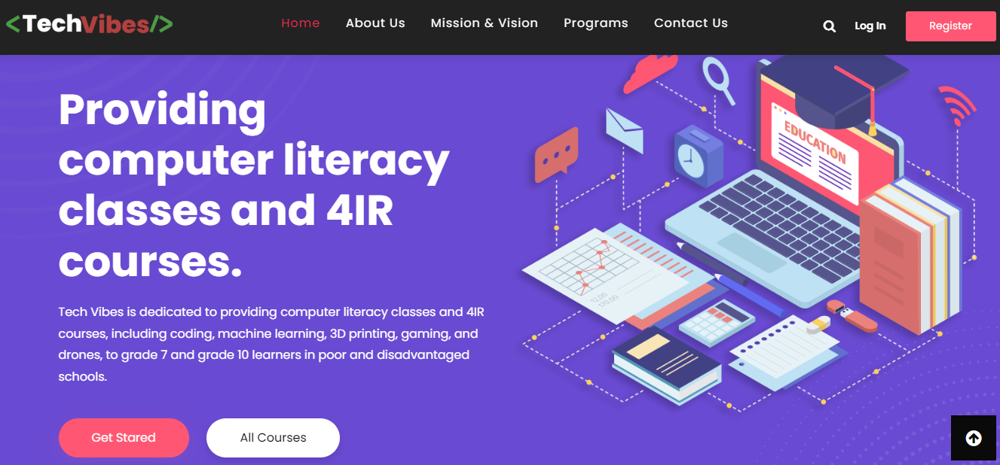

# Tech Vibes NGO Website

## Table of Contents
- [Tech Vibes NGO Website](#tech-vibes-ngo-website)
  - [Table of Contents](#table-of-contents)
  - [About](#about)
  - [Tools Used](#tools-used)
  - [Requirements](#requirements)
  - [Setup and Run](#setup-and-run)
  - [Contributing](#contributing)
  - [License](#license)

## About
This repository contains the codebase for the official website of Tech Vibes, an NGO dedicated to providing computer literacy classes and 4IR courses to disadvantaged schools.

## Tools Used
The project was developed using HTML, CSS, and JavaScript.

## Requirements
Developers are recommended to use:
- Visual Studio Code (VSCode) as the IDE
- Live Server extension for VSCode

## Setup and Run
To set up and run the project locally, follow these steps:
1. Clone this repository to your local machine.
2. Open the project in Visual Studio Code.
3. Use the Live Server extension to launch the website.
4. Explore the site in your preferred web browser.

## Contributing
We welcome contributions from the community. To contribute, please follow these guidelines:
- Fork the repository.
- Create a new branch for your feature or bug fix.
- Make your changes and test thoroughly.
- Submit a pull request, detailing the changes made.

## License
This project is licensed under the [MIT License](LICENSE).
